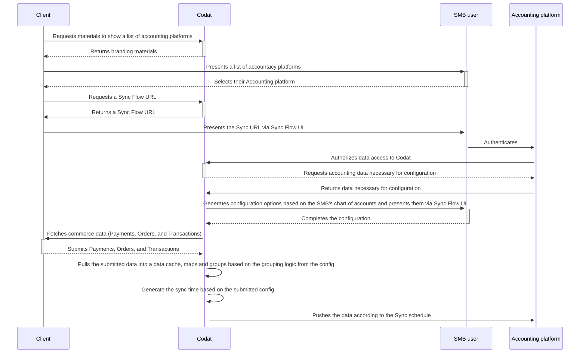

```mermaid
sequenceDiagram
  participant Client
  participant Codat
  participant SMB user
  participant Accounting platform

    Client->>+Codat: Requests materials to show a list of accounting platforms
    Codat-->>-Client: Returns branding materials
    Client->>+SMB user: Presents a list of accountacy platforms
    SMB user-->>-Client: Selects their Accounting platform
    Client->>+Codat: Requests a Sync Flow URL
    Codat-->>-Client: Returns a Sync Flow URL
    Client->>+SMB user: Presents the Sync URL via Sync Flow UI
    SMB user->>+Accounting platform: Authenticates
    Accounting platform->>+Codat: Authorizes data access to Codat
    Codat-->>-Accounting platform: Requests accounting data necessary for configuration
    Accounting platform->>+Codat: Returns data necessary for configuration
    Codat->>+SMB user: Generates configuration options based on the SMB's chart of accounts and presents them via Sync Flow UI
    SMB user-->>-Codat: Completes the configuration
    Codat->>+Client: Fetches commerce data (Payments, Orders, and Transactions)
    Client-->>-Codat: Submits Payments, Orders, and Transactions
    Codat->>+Codat: Pulls the submitted data into a data cache, maps and groups based on the grouping logic from the config
    Codat->>+Codat: Generate the sync time based on the submitted config
    Codat->>+Accounting platform: Pushes the data according to the Sync schedule

```
